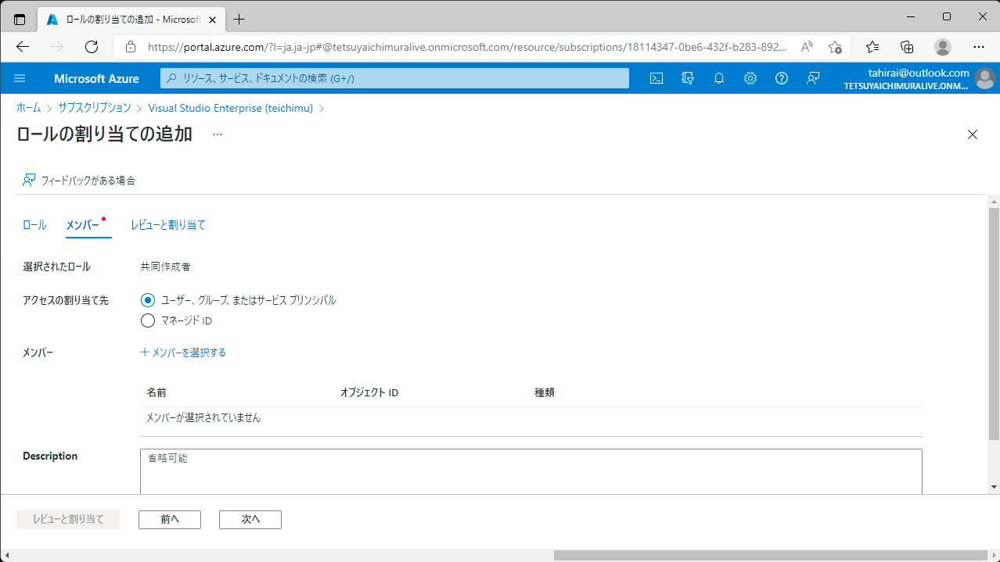
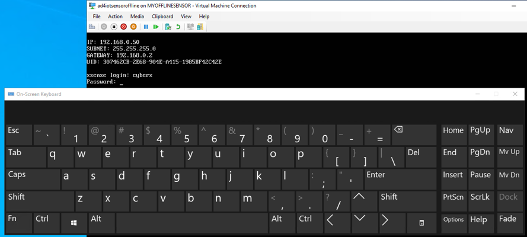

# Internet of Things - Microsoft Defender for IoT ハンズオン

作業を開始する前に [事前準備](../Before%20HOL%20Jpn/Microsoft%20Defender%20for%20IoT%20BHOL.md "Microsoft Defender for IoT Before Hands-on-Lab") が完了しているか、今一度ご確認ください  

> 最終更新日: 2022/04/12  
> 対象 : Defender for IoT 10.5.x

## アーキテクチャ ダイアグラム ##

このハンズオンでは、IoT センサー向け、オンラインアラート、そしてオフラインシナリオ用の Microsoft Defender のセットアップに重点を置き、環境の構築方法、結果の評価、及び Microsoft Sentinel のような SIEM システムとの統合方法について学習します  

具体的にはブラウンフィールド（既存）、及びグリーンフィールド（新規）デバイスが存在する施設のセキュア化に焦点を当てます  
（グリーンフィールド デバイス向けの作業はまだハンズオンに組み込まれていません）

以下の図は工場に当てはめた例ですが、同様なシナリオはエネルギープラントなど多く存在します  


## **コンテンツ:** ##

- [演習 #1: Defender を有効化する](#演習-1-defender-を有効化する)
   - [作業 1: Microsoft Defender for IoT を有効化する](#作業-1-microsoft-defender-for-iot-を有効化する)
   - [作業 2: IoT Hub を作成する](#作業-2-iot-hub-を作成する)
   - [作業 3: センサーをオンボード (有効化) する](#作業-3-センサーをオンボード-有効化-する)
- [演習 #2: オフラインセンサーを設定する](#演習-2-オフラインセンサーを設定する)
   - [作業1: オフラインセンサー (nested hyper-v/VM) を設定する](#作業-1-オフラインセンサー-nested-hyper-vvm-を設定する)
   - [作業2: オフライン用の Microsoft Denfender for IoT を構成する](#作業-2-オフライン用の-microsoft-denfender-for-iot-を構成する)
- [演習 #3: システム設定を有効にする](#演習-3-システム設定を有効にする)
   - [作業1: システム プロパティ](#作業-1-システム-プロパティ)
   - [作業2: PCAP ファイル](#作業-2-pcap-ファイル)
- [演習 #4: データを分析する](#演習-4-データを分析する)
   - [作業1: デバイスマップ](#作業-1-デバイスマップ)
   - [作業2: アラート](#作業-2-アラート)
   - [作業3: デバイス インベントリ](#作業-3-デバイス-インベントリ)
   - [作業4: イベントタイムライン](#作業-4-イベント-タイムライン)
   - [作業5: データ マイニング](#作業-5-データ-マイニング)
   - [作業6: リスク アセスメント](#作業-6-リスク-アセスメント)
- [演習 #5: オンラインセンサーを設定する](#演習-5-オンラインセンサーを設定する)
   - [作業1: センサーの再設定](#作業-1-センサーの再設定)
- [演習 #6: Sentinel と統合する](#演習-6-sentinel-と統合する)
   - [作業1: IoT を Sentinel に統合する](#作業-1-iot-を-sentinel-に統合する)
   - [作業2: データコネクターを接続する](#作業-2-データコネクターを接続する)
   - [作業3: アラートを確認し PCAP を実行する](#作業-3-アラートを確認し-pcap-を実行する)
   - [作業4: IoT インシデントと Sentinel の連携](#作業-4-iot-インシデントと-sentinel-の連携)
   - [作業5: Kusto クエリ言語 でアラート詳細を検索する ](#作業-5-kusto-クエリ言語-でアラート詳細を検索する)
- [演習 #7: クリーンアップ](#演習-7-クリーンアップ)
   - [作業1: リソースの削除](#作業-1-リソースの削除)
- [付録 #1: トラブルシューティング](#付録-1-トラブルシューティング)

## 演習 #1: Defender を有効化する
### 作業 1: Microsoft Defender for IoT を有効化する
この作業は、後に用いる Microsoft Defender for IoT をホストする VM 上ではなく、PC から Azure ポータルにアクセスして行います  
1. [Azure ポータル](https://portal.azure.com/#home "Microsoft Azure Home") の検索ボックスに **defender for iot** を入力し、サービスの項目に表示された **Microsoft Defender for IoT** をクリックします  
   
1. 左メニュー Management の **Pricing** をクリックします  
   

1. 画面中央に表示された **サブスクリプションのオンボード** をクリックします  
     

1. サブスクリプションが今回のハンズオンに用いるものであることを再確認の上、Purchase method を **Trial** に変更し、**I accept the terms** にチェックを入れ、**保存** をクリックします  

   

以上で 100台 までデバイスを監視可能な Microsoft Defender for IoT の 30日間 無償試用版が開始します

   > **NOTE:** Trial はサブスクリプションごとに1回のみとなります (無効化後に再度有効化を行っても期限は延長されません)

### 作業 2: IoT Hub を作成する
この作業は PC から Azure ポータルにアクセスして行います  

このハンズオンではオンラインセンサー、オフラインセンサーの両方を利用します  
オフラインセンサーはネットワークが切断された状態でも動作しますが、オンラインセンサーは Azure IoT Hub に接続する必要があります  

センサーをオンボードする前に、オンラインセンサー用の Azure IoT Hub を作成します  

1. [Azure ポータル](https://portal.azure.com/#home "Microsoft Azure Home") の検索ボックスに **IoT Hub** と入力し、サービスの項目に表示された **IoT Hub** をクリック、**作成** をクリックします  

1. 基本タブで必要な情報を記入します  
   - **サブスクリプション**: ハンズオンで用いるものが選択されていることを再確認します
   - **リソースグループ**: ハンズオン用に作成したリソースグループを選択します
   - **IoT Hub 名**: IoT Hub の名前を入力します (md4iot-固有のサフィックスを推奨、例: md4iot-tahirai)
   - **領域**: IoT Hub を設置するリージョンを選択します（Japan East を推奨）

   
   
1. 管理タブで価格とスケールティアが **S1: Standard レベル** になっていることを確認し、画面下部の **確認および作成** 、続いて **作成** をクリックします

ここで Microsoft Sentinel がアラートを収集できるように アクセス制御 を追加します

1. [Azure ポータル](https://portal.azure.com/#home "Microsoft Azure Home") で **サブスクリプション** をクリックし、ハンズオンで用いるものをクリックします

1. メニューから **アクセス制御 (IAM)** をクリック、続いて **追加** 、**ロールの割り当ての追加** をクリックします  

1. **共同作成者** をクリックし、**次へ** をクリック、**メンバーを選択する** でサブスクリプションにアクセスしているアドレスを検索、**選択** をクリック、戻った画面で **レビューと割り当て** をクリックします  

   

### 作業 3: センサーをオンボード (有効化) する
この作業は PC から Azure ポータルにアクセスして行います  

このハンズオンではインターネットへの接続が不要なオフラインセンサーと、Azure に接続されたオンラインセンサーの両方を利用します  
まず、オフラインセンサーのオンボーディング（有効化）を行います  

1. [Azure ポータル](https://portal.azure.com/#home "Microsoft Azure Home") の検索ボックスに **Defender** を入力し、サービスの項目に表示された **Microsoft Defender for IoT** をクリックします  
<!--
1. **センサー** タブをクリックし、**アプライアンスの購入とソフトウェアのインストール**、**バージョンの選択** で **10.5.5（安定）以上 - 推奨** を選択し、**ダウンロード** をクリック、ISO ファイルを入手します  
     

   > **NOTE:** お問い合わせ ポップアップウィンドウ は **送信せずに続行** で継続ください  
//-->

1. 左メニュー Management の **Site and sensors** をクリックし、**OTセンサーのオンボード** をクリックします  
     

1. センサー名 に **myofflinesensor** と入力、サブスクリプションに今回ハンズオンで用いるものを選択し、**クラウドに接続済み** を無効にした後 **登録** をクリックします  
     
1. センサーアクティベーション用のファイル保存が促されますので、保存して **完了** をクリックします
     
1. **Site and sensors** に新しいセンサーがオンボードされたのを確認します  
     

続いてもう一つのセンサー、オンラインセンサーをオンボーディングします  

1. **OTセンサーのオンボード** をクリックし、以下のように記入、設定します  
   - **センサー名:** myonlinesensor  
   - **サブスクリプション:** 今回ハンズオンで用いるものを選択  
   - **クラウドに接続済み:** 有効（標準のまま）  
   - **脅威インテリジェンスの自動更新:** 有効（標準のまま）  
   - **センサーのバージョン:**  バージョン 10X 以下 を選択
サイト セクションは、
   - **ハブ** 先ほど作成した IoT Hub を選択します
   - **名前:** MD4IoTHub を入力 
   - **表示名:**  (標準のまま)
   - **ゾーン:**  (標準のまま)

   

1. **登録** をクリックします  
1. センサーアクティベーション用のファイル保存が促されますので、保存して **完了** をクリックします

1. 改めて **Site and sensors** で2つのセンサーがオンボードされたのを確認します  

   

2つのファイル（センサー向けアクティベーション用ファイル）をダウンロードしました  
Defender for IoT センサーをホストする 仮想PC(VM) への接続には RDP を利用しますので、アクティベーション用ファイルを利用する VM に対して copy (ctrl-c) and paste (ctrl-v) でコピーできます  

## 演習 #2: オフラインセンサーを設定する
この作業は [事前準備](../Before%20HOL/Microsoft%20Defender%20for%20IoT%20BHOL.md "Microsoft Defender for IoT Before Hands-on-Lab") で作成した VM 上で行います

### 作業 1: オフラインセンサー (nested hyper-v/VM) を設定する

事前準備で作成した WIndows 10 VM に RDP でログインします  

1. コマンドプロンプトで "ipconfig" を実行します

   

1. ホストの Ethernet アダプタ の IPアドレス を控えます、 (Default Switch) は無視してください

   > **NOTE:** この例では ホストの Ethernet アダプタに 10.0.0.4 の IP が割り当てられていますので、192.168.0.0/24 を "NATSwitch" のネットワークスコープとして用いますが、もし Primary アダプタで 192.168.x.x を既に利用している場合には、172.27.0.0/24 を用いてください

1. PowerShell を検索し、右クリックから **管理者として実行** をクリックします

1. 次の2つのコマンドを PowerShell 上で実行します
   ```powershell
   New-VMSwitch -SwitchName "NATSwitch" -SwitchType Internal
   ```
   ```powershell
   New-VMSwitch -SwitchName "MySwitch" -SwitchType Internal
   ```
1. 次のコマンドを実行し、ネットワークアダプタ の情報をローカル変数に保存します
   ```powershell
   $s1 = Get-NetAdapter -name "vEthernet (NATSwitch)"
   ```
1. IP アドレスを NATSwitch に割り当てます (192.168.0.1 または 172.27.0.1)
   ```powershell
   New-NetIPAddress -IPAddress 192.168.0.1 -PrefixLength 24 -InterfaceIndex $s1.ifIndex
   ```
1. 新しい NAT ネットワークを作成します (192.168.0.0/24 または 172.27.0.0/24)
   ```powershell
   New-NetNat -Name MyNATnetwork -InternalIPInterfaceAddressPrefix 192.168.0.0/24
   ```
   


1. VM 内の検索ボックスに **Hyper-V** と入力し Enter を押すと新しい Hyper-V コンソールが表示されますので、左メニューから **New** を選択、表示された項目の中から **Virtual Machine...** をクリックします

   

1. VM を以下のように設定します

   - 最初のタブで VM の名前に **md4iotsensoroffline** を入力し、**Next** をクリック
   - **Specify Generation** で **Generation 1** を選択し、**Next** をクリック
   - メモリを **8196MB** に変更し **Next** をクリック
   - **Configure Network** タブの **Connection** で **NATSwitch** を選択し、**Next** をクリック
   - **Connect Virtual Hard Disk** タブで **Create a virtual hard disk** で **Next** をクリック
   - **Installation Options** で **Install an operating system from a bootable CD/DVD-ROM** を選択、**Image file (.iso)** でダウンロードした Azure Defender の iso ファイルを指定し **Finish** をクリック

   

1. 作成した VM を右クリック、**Add Hardware** セクションの **Settings** を選択、 **Network Adapter** を選択し、**Add** をクリック、ここで **My Switch** という名前で以前作成した Virtual Switch を選択し、**Apply** 、続いて **OK** をクリック、仮想プロセッサー数を **1** から **4** に増やし、**Apply** 、続いて **OK** をクリックします


### 作業 2: オフライン用の Microsoft Denfender for IoT を構成する

ここでは Microsoft Defender を 以前設定した IP アドレスに基づき設定します  

1. Hyper-V Manager で画面右下にある **Connect...** をクリック、表示された仮想マシンのウィンドウで **Start** をクリックします

   > **Note!**: 以下の画面が表示されない場合は、インストールがタイムアウトしたか、違う設定を選択して Enter を入力された可能性がありますので、仮想マシンを削除してこのタスクをやり直してください (タイムアウト時間は比較的短いため、出来るだけ早く仮想マシンに接続し、言語とセンサーの種類を選択ください)

   

1. English が選択された状態で **Enter** を入力します

1. (カーソルキーで) メニューの3つめ *(Office 4CPUs...)* を選択し **Enter** を入力します

   

   ここでオフラインセンサーがインストールされます (OSを含む)  
   このインストールは約15分程度かかります  

1. インストールプロセスの一部としていくつかのパラメーターを入力します、

   この設定は **非常に重要** です  
   ネットワーク設定はここまでに設定したネットワーク情報にも関連し、仮想マシンに対して**固有** となります

   - **configure hardware profile**: **office** を入力して **Enter**
   - **configure network interface**, **eth0** を入力して **Enter**
   - **configure management network interface**: (今回の例では) **192.168.0.50** 、または **172.27.0.50** を入力して **Enter**
   - **subnets mask**: **255.255.255.0** を入力して **Enter**
   - **configure DNS**: **8.8.8.8** を入力して **Enter**
   - **configure default gateway IP Address**: 192.168.0.**2** または 172.27.0.**2** を入力して **Enter** (センサーを強制的に **オフライン** にするために、意図的に**誤**設定します)
   - **configure input interface(s)**: **eth1** を入力して **Enter**
   - **configure bridge interface**: **Enter** (値は何も入力しない)
   - **Y** を入力して **Enter**.

   以下は **入力例** です (環境により異なるかもしれません)

   

   入力後インストールが継続し、(再度) 10-15分程度かかります  

1. ***非常に重要なステップです!!!*** インストールが完了するとログイン情報が表示されますので、**画面のスクリーンショットを取得して** から **Enter** を入力、続いてサポートアカウント情報が表示されますので、再度 **画面のスクリーンショットを取得して** から **Enter** を入力します

   > ***Note!**: スクリーンショットの取得に失敗すると、作業を最初からやり直しになりますのでご注意ください*

   

1. インストールが完了するとログインが求められますので直前のステップで得た情報を入力してください  

   この画面では、後にブラウザからアクセスする際に用いる IP アドレスを確認することができます  

   > ***Note!**: この段階では IP は以下の例のように見えるはずですが、もしアクセスできない場合には IP を検証してください (VMを再起動した場合、IPが変更されている可能性がありますので、戻って再設定の必要があります)*

   > ***Troubleshooting Note:***

   ```bash
   sudo cyberx-xsense-network-reconfigure
   ```

   パスワードを入力する際、いくつか似て異なる文字が存在することに注意してください  
   以下の画像を参考にしてください

   

1. ステップ **6** で提供されたログイン情報を用いてログインします

   

   > **Note:** "md4iotsensoroffline" 仮想マシンのKBレイアウトは標準で US のため、作業PCの入力と一致しない可能性があります  
   > その場合は Windows 10 のオンスクリーンキーボード でパスワード入力時のトラブルを回避可能です  
   > タスクバーの検索ボックスで **on** と入力すると表示される "On-Screen Keyboard" を実行します

   

   > クレデンシャル入力時に利用します

   

1. ブラウザーでセンサーにログイン後、製品のアクティベーションが求められますので **Upload** をクリック、**Browse Files** をクリック、ダウンロードフォルダを選択してライセンスファイルを指定します (例: myofflinesensor_activation_10.X.zip)

   

1. **Approve these terms and Conditions** をクリックして **Activate** をクリックします

1. 続いて **SSL/TLS Certificates | Onboarding 1/2** の設定が表示されますので、**Use a locally generated self signed certificate(..)** をクリック、**I CONFIRM** のチェックを入れ **Next** をクリックします

   

1. 続いて **SSL/TLS Certificates | Onboarding 2/2** の設定は **Disable** で **Finish** をクリックします

   

事前に取得した情報を用いて分析してみましょう  

## 演習 #3: システム設定を有効にする

### 作業 1: システム プロパティ

1. センサー画面の左メニューにある **System Settings** をクリックします

   

1. 右側に **System Properties** のアイコンが表示されますのでクリック、警告ポップアップが表示されますので **Ok** をクリックします

1. 左側のメニューを **Pcaps** が表示されるまでスクロールさせクリック、右側に表示された設定をスクロールして、以下のように3つのパラメータを変更します

   - **player_max_amount=200**
   - **player.params=-M 3**
   - **enabled=1**

   これらは PCAP Player を有効にし、リアルタイムより高速に再生できるようにするための設定です

   

1. **Save** 、続いて **Ok** をクリックします.

1. この時点で PCAP Player が有効になっていることを確認できます (**Cancel** をクリックして **Edit System Properties** スクリーンを閉じることができます)

   

### 作業 2: PCAP ファイル

In a previous step you already downloaded a  **holpcaps.zip** file from the Storage account. It should be in your Azure Virtual Machine's **Downloads** folder.  

1. PCAP ファイル(holpcaps.zip) を解凍します
1. センサー (ブラウザ) に戻り **System Settings** をクリック、**PCAP Player** の **Upload** 、**Browse Files** をクリックし、解凍されたファイルを全て選択して **Open** をクリックします (アップロードには数分かかります)  

1. この段階でアップロードされたファイル群を確認できます  

   

1. **Play All** をクリック、数分後全てのファイルが再生された旨のメッセージが表示されます  

## 演習 #4: データを分析する

環境学習が完了すると、非常に迅速な洞察が可能になります  

### 作業 1: デバイスマップ  

初めてデバイスマップを操作する際には以下のようなマップが表示されます (内容が異なる場合もあります)  
   

1. 左の4つのアイコンの上から3つめ、**layout options** から **Layout by Purdue** をクリックします  
   このモデルでは、企業ITとサイトオペレーションの間の様々なレイヤーを見ることができます  
   

1. 利用可能な通知を確認し、この時点でアクションを起こすことができます
   

1. 各デバイスを右クリックし、プロパティの分析、イベントの表示、レポート、攻撃ベクトルのシミュレーションを行います
   

1. All Devices の左の ハンバーガーメニューをクリック、**OT Protocols** (例: **MODBUS**) をクリック、そして **Filter** をクリックします  
   マップ上のデバイスにそのプロトコルを用いるものだけが表示されます  
   

1. 次に **CIP** OT プロトコルによってデバイスをフィルタリングします  
   マップに Rockwell Automation の PLC が表示され、既に3つのアラートが有効になっていることが分かります  
   デバイスを右クリックし **View Properties** をクリックします  
   このビューで PLC のバックボーンを分析し、アクションをとり、アラートを分析できます  
   

### 作業 2: アラート

1. PLCの Alerts をクリックすると新しいウィンドウが開き、3種類のアラートが表示されます  

   - OPERATIONAL (High Alert - 赤 と Lower Alert - オレンジ)
   - POLICY VIOLATION (ポリシー違反)

   これらのアラートごとに、Pcap ファイルの解析、レポートのエクスポート、タイムラインの解析、アラートのミュートが可能です
   
    
1. デバイスフィルター (ここでは IP アドレス) を削除して **Confirm** をクリックすると、大量のアラートが表示されます

1. 異なるシナリオをフィルターするために **Advanced Filters** をクリック、**All Device Group** から **Unclassified subnets** のような **Custom Groups** をクリックし **Confirm** をクリックします
   

### 作業 3: デバイス インベントリ

1. 全てのデバイスを **Is Authorized** でフィルタリングします (値は True または False となります)  

   > **NOTE:** "Is Authorized" が表示されない場合には、右上の歯車アイコン "Device Inventory Settings" から "Is Authorized" の項目にチェックを入れてビューに追加します  

   

1. フィルターに基づきデバイスを整理します  
1. リストを CSV ファイルとしてエクスポートします

### 作業 4: イベント タイムライン

このビューではアラートのフォレンジック分析が可能です

1. **Advanced Filters** を選択、タイムラインを **CIP** でフィルタリングして、アラートタイムラインを分析します  
   

### 作業 5: データ マイニング

このセクションでは複数のカスタムレポートを作成することができます  
例として、ファームウェアの更新バージョンに基づくレポートを作成します  

1. **+** から, **New Report** をクリック、表示されたカテゴリから **Modules and Firmware Versions** を選択します  

1. **Name:** と **Description:** を入力し、**Filters:** の **add** から **Firmware version(GENERIC)** を選択します 

   

1. 追加された **Firmware Version(GENERIC)** フィールドに **0.4.1** を入力し、**Save** をクリックします

   
   
1. フィルタを削除して全てのファームウェアバージョンをリストアップすることもできます

1. レポート (PDF/CSV) をエクスポートして、今後の作業に役立てることができます  

### 作業 6: リスク アセスメント

1. **Risk Assessment** に移動し、**Generate Report** をクリックします  
タスク実行中、どのようにしてアセスメントを分析するかをご紹介します  

## 演習 #5: オンラインセンサーを設定する

今回は、ここまで使用したオフラインセンサー (の仮想マシン) をオンラインセンサーとして再利用します  
現実のシナリオではおそらく独自の仮想マシン、または物理アプライアンスで動作する新しいセンサーを作成することになります  

### 作業 1: センサーの再設定

センサーを Azure に接続するため、ネットワーク設定を変更します

To modify your sensor to be connected with Azure, you will need to modify the network configuration.

1. センサーの画面から **System Settings** をクリック、続いて **Network** をクリックします

   

1. Default Gateway の IP アドレスを 192.168.0.1 または 172.27.0.1 に変更します
 
    

1. "md4iotsensoroffline" 仮想マシン接続画面の **Action** から **Ctrl+Alt+Delete** をクリックし、センサーを再起動します

   

1. (再起動後) 再びセンサーにブラウザでログインし、**System Settings** をクリック、続いて **Reactivation** をクリックします  

1. Reactivation の画面で Upload をクリック、続いて **Browse File** をクリックし、オンラインセンサー用のライセンスファイルを選択し、**Open** をクリック、**Activate** 、**OK** をクリックします

   

1. ここで、センサーが **Connected** に変更されたメッセージを受け取ります

1. スクリーンを閉じ、再び **Reactivation** ウィンドウを開き、センサーが下図のように **Cloud Connected** になっているかどうか再確認します  

   

1. 再度 Pcap ファイルを再生し、数分後 Azure ポータル の IoT Hub がセンサーからメッセージを受信しているかどうかを確認します  

   

1. IoT Hub で Defender for IoT が生成したアラートが表示されるようになります  
   メニューを **Defender for IoT** までスクロールし **Security Alerts** を選択すると、右側にアラートが表示されます  

   

## 演習 #6: Sentinel と統合する

You will execute most of this task on your physical machine, not in the Virtual Machine that hosts your your Microsoft Defender for IoT sensor.

> **Note**: Please ensure you have completed Task 6 in the ['Before HOL'](../Before%20HOL/Microsoft%20Defender%20for%20IoT%20BHOL.md "Microsoft Defender for IoT Before Hands-on-Lab") instructions prior to working through the following tasks.

### 作業 1: IoT を Sentinel に統合する

1. セキュリティアラート を Sentinel に送信するよう IoT Hub が設定されていることを確認します
1. IoT Hub > Defender for IoT > 設定 > Data Collection に移動します

   

1. **Enable Microsoft Defender for IoT** が有効になっていることを再確認します

   

### 作業 2: データコネクタを接続する

1. *Microsoft Defender for IoT* スイッチが有効になっている状態で、**Microsoft Sentinel** > 構成 > データ コネクタ > **Microsoft Defender for IoT** を検索し、Microsoft Defender for IoT を Microsoft Sentinel に接続します
 
   

1. **コネクタ ページを開く** をクリックします
 
   

1. "接続" ボタンをクリックして Microsoft Defender for IoT を Sentinel に接続します  
   接続に失敗する場合、ユーザーが "共同作成者" アクセス許可を持っていない可能性があります

   

1. 正しく接続された場合は、ステータスが "接続済み" に変わり、リンクが緑色に点灯します  
 
   

1. "次の手順" タブを利用して、Box アラートを有効にします  
   例えば "ルールの作成" をクリックし、指示に従ってルールを有効にします  
 
   

1. "名前" を入力し、"確認と作成" をクリック、続いて "作成" をクリックします  
   これにより、Microsoft Defenfer for IoT アラート基づいてインシデントを作成できます

   

1. 更にデータコネクタ ページだけでなく Microsoft Sentinel の "分析" ブレードでもルールを作成できます  
   "規則のテンプレート" タブに移動し、“Microsoft Defender for IoT (Preview)” でデータソースをフィルター処理する場合は、以下の例を参照してください  

   

### 作業 3: アラートを確認し PCAP を実行する

この作業は Microsoft Defender for IoT センサーをホストする仮想マシン上で行います  

1. センサーのダッシュボード(ブラウザ) のアラートに移動し、全てのアラートを確認 (Acknowledge All) します  
   これにより、アラートの再実行結果が Sentinel にどのように送信され、分析されるか確認できます

	1. Alerts に移動します
	1. 二重チェックボックスをクリックします
	1. **Ok** をクリックしてアラートを確認します 
    
   

    1. System Setting に移動します
    1. PCAP Player の **Play All** をクリックして、アラート シミュレーションを再実行します  

   

### 作業 4: IoT インシデントと Sentinel の連携

この作業は PC から Azure ポータルにアクセスして行います  

1. Sentinel の画面に戻り、**脅威管理** セクションの **インシデント** タブをクリック、**Microsoft Defender for IoT" の製品名でフィルター処理します

   

1. アラートの1つをクリック、続いて **全ての詳細を表示** をクリックします

   

1. インシデントに関する全ての情報はこの画面で取得できます  
   インシデントを構成する他のアラート、アラートのコンテキストを豊かにするプレイブック、レビュー中にアナリストが発見したことや、インシデントの却下に至った方法に関する詳細を残すコメントセクションなど、エンティティの詳細を取得できます

   

1. **調査** をクリックして、インシデントの原因と他のインシデントとの関係を深く掘り下げます

   

### 作業 5: Kusto クエリ言語 でアラート詳細を検索する

1. Sentinel の "ログ" タブに移動し、クエリを実行します  
   データをクエリするとテーブルとデータセットを結合して複数ソースのデータを管理できます
   KQL は SQL と同様の言語ですが、慣れ親しむためには時間と経験を必要とします  

   2つの基本的な例を次に示します  

   ```sql
	SecurityAlert | where ProviderName contains "IoTSecurity"
   ``` 
 
   

   ```sql
   SecurityAlert | where CompromisedEntity == "hub-md4iot-mst01"
   ```
 
   

## 演習 #7: クリーンアップ

### 作業 1: リソースの削除

このハンズオンのために作成したリソースグループを検索して選択、**リソースグループの削除**  をクリックします  

フィールドに削除対象のリソースグループ名を入力し (例:rg-md4iot-tahirai) **削除** をクリックします  
この作業は数分かかります  

リソースグループの削除完了誤、Microsoft Defender for IoT をサブスクリプションから無効化します  


## 付録 #1: トラブルシューティング

1. 仮想マシン上のダッシュボードが正常に動作しない場合は、仮想マシンのターミナル上で次のコマンドを実行し、コンポーネントが正しく動作しているかを確認します  

   ```powershell
   cyberx-xsense-sanity
   ```
   

1. IoT Hub がメッセージを受信しない場合は、センサー (仮想マシン) が IoT Hub に到達できるかを確認します  
   まず、以下のコマンドを実行して IoT Hub の IP を識別します  

   ```powershell
   netstat -na | grep EST | grep -v 127.0.0.1
   ```

   

   続いて IoT Hub のアドレスを用いて IoT Hub に Ping を実行します

   

